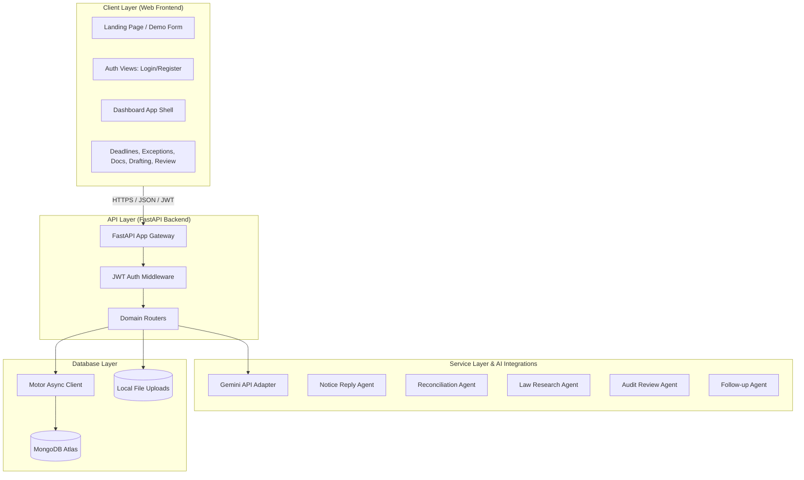

# LedgerDesk CA — System Architecture & Documentation

This document explains the objectives, technical architecture, data flows, database schemas, and configuration patterns of LedgerDesk CA.

---

## 1. Objectives & Main Purpose

LedgerDesk CA is a **Practice Operating System** designed for Indian Chartered Accountant (CA) firms handling multi-client statutory compliance, audits, and notice replies. 

Unlike general-purpose accounting systems or simple todo-list tracking software, LedgerDesk CA focuses on the core bottleneck of professional practice operations: **exception-driven workflow control**.

### Core Value Pillars:
1. **Fewer Missed Deadlines**: Centralizes the multi-client statutory calendar (GST, TDS, Tax Audits, ROC, Notices) into a single workspace with automated risk escalations.
2. **Reduced Clerical Chase**: Systematizes follow-ups for client documents (e.g., purchase registers, bank statements, challan proofs) with logged reminders, replacing fragmented email/WhatsApp threads.
3. **Controlled Review Trails**: Implements structured review pipelines (Awaiting Manager → Awaiting Partner → Returned with Comments → Approved) with versioned history logs and immutable sign-offs.
4. **Constrained AI Co-Pilot**: Integrates specialized AI agents (Notice Reply, Reconciliation, Legal Research, Audit Review, Follow-up) that operate strictly as draft generators with source-citation requirements and human-in-the-loop validation.

---

## 2. Technical Architecture

LedgerDesk CA is designed as a modular, full-stack B2B SaaS application.



### Component Stack:
- **Frontend**: Vanilla HTML5, CSS3 Custom Properties (Design Tokens), and asynchronous ES6 JavaScript (Fetch API for dynamic client-side state handling).
- **Backend Framework**: Python 3.12 + FastAPI (Uvicorn server) for high-performance, non-blocking asynchronous requests.
- **Database Driver**: `motor` (async MongoDB client for Python) paired with `pymongo` for native aggregation operations.
- **Database**: MongoDB Atlas (Cloud NoSQL) for flexible schema storage handling semi-structured compliance, review comments, draft revisions, and logging.
- **AI Engine**: Google Gemini API via `google-generativeai` SDK.

---

## 3. Data Models & Database Schemas

LedgerDesk CA operates with **nine core MongoDB collections**:

### `users`
Tracks firm employees and their roles.
```json
{
  "_id": "ObjectId",
  "name": "N. Deshpande",
  "email": "partner@deshpandeca.com",
  "password_hash": "$2b$12$...",
  "firm_name": "Deshpande & Co CAs",
  "role": "partner", // partner, manager, executive, clerk
  "created_at": "ISODate"
}
```

### `clients`
Central directory of all active accounts under practice management.
```json
{
  "_id": "ObjectId",
  "name": "Mangal Metals Pvt Ltd",
  "gstin": "27AAACM1234F1Z5",
  "pan": "AAACM1234F",
  "contact": "+91 98765 43210",
  "status": "active", // active, inactive
  "created_by": "userId",
  "created_at": "ISODate"
}
```

### `deadlines`
Statutory compliance calendar items.
```json
{
  "_id": "ObjectId",
  "client_id": "clientId",
  "client_name": "Mangal Metals Pvt Ltd",
  "obligation": "GSTR-3B Filing",
  "period": "Jun 2026",
  "due_date": "ISODate(2026-07-20T00:00:00Z)",
  "owner": "Priya S",
  "status": "pending", // pending, in_prep, awaiting_docs, in_review, filed, overdue
  "blocker": "Purchase register missing"
}
```

### `exceptions`
Reconciliation breaks and portal mismatch items.
```json
{
  "_id": "ObjectId",
  "client_id": "clientId",
  "client_name": "Mangal Metals Pvt Ltd",
  "type": "GSTR-2A mismatch", // TDS variance, Bank reconciliation break, etc.
  "affected_entries": 14,
  "value_impact": "₹2.8L",
  "age": "3 days",
  "assigned_to": "Priya S",
  "next_action": "Ask client for purchase register",
  "state": "Open" // Open, In progress, Pending review, Escalated, Resolved
}
```

### `documents`
Chasing requirements, file associations, and reminder metrics.
```json
{
  "_id": "ObjectId",
  "client_id": "clientId",
  "client_name": "Mangal Metals Pvt Ltd",
  "requested_item": "Purchase register",
  "related_task": "GSTR-3B prep",
  "requested_on": "11 Jul",
  "reminder_count": 2,
  "last_response": "Reminder #2 sent by Priya S",
  "impact": "Filing at risk",
  "status": "Awaiting client", // Awaiting client, Partial received, Received, Escalate
  "file_path": "./uploads/mangal_metals_purchase_register.xlsx"
}
```

### `drafts`
Source-linked notice responses and audit papers with inline version numbers.
```json
{
  "_id": "ObjectId",
  "client_id": "clientId",
  "client_name": "Orbit Buildcon",
  "matter": "GST SCN on ITC mismatch",
  "draft_type": "Notice reply", // Reconciliation note, Audit note, Submission
  "content": "To,\nThe Assistant Commissioner (GST)...",
  "prepared_by": "Rohan V",
  "reviewer": "N. Deshpande",
  "state": "Draft ready", // Requested, In progress, Draft ready, Returned, Approved
  "due_by": "18 Jul",
  "comments": [
    {
      "author": "N. Deshpande",
      "text": "Add the reconciliation summary as Annexure A.",
      "timestamp": "ISODate"
    }
  ],
  "version": 1.1,
  "created_at": "ISODate"
}
```

### `reviews`
Review lifecycle details.
```json
{
  "_id": "ObjectId",
  "work_item_id": "draftId or exceptionsId",
  "work_item_type": "Notice reply draft", // GST reconciliation summary, etc.
  "client_id": "clientId",
  "client_name": "Orbit Buildcon",
  "item_name": "GST SCN reply v0.9",
  "submitted_by": "Rohan V",
  "reviewer": "N. Deshpande",
  "status": "Awaiting partner", // Awaiting manager, Awaiting partner, Returned, Approved, Exported
  "comments": [],
  "risk_flag": "High", // Low, Medium, High
  "timestamp": "ISODate",
  "export_state": "Not exported", // Not exported, Exported
  "version": "v0.9"
}
```

### `audit_logs`
Immutable trails of action records.
```json
{
  "_id": "ObjectId",
  "user_id": "userId",
  "action": "approve_review", // login, create_client, upload_document, etc.
  "resource_type": "review",
  "resource_id": "reviewId",
  "details": "Review status set to Approved by N. Deshpande",
  "timestamp": "ISODate",
  "ip_address": "49.15.92.152"
}
```

### `demo_bookings`
Stores potential B2B demo requests from the landing page.
```json
{
  "_id": "ObjectId",
  "name": "Amit Sharma",
  "email": "amit@sharmaca.in",
  "firm_name": "Sharma & Associates CAs",
  "firm_size": "6-15",
  "phone": "9812345670",
  "preferred_date": "ISODate(2026-07-22)",
  "message": "Interested in GST notice drafting tools.",
  "created_at": "ISODate"
}
```

---

## 4. System Data Flows

### A. Document Request and Client Upload Flow
```
[Executive] ──(Create Request)──> [FastAPI Backend] ──(Save Document Record)──> [MongoDB]
                                                                                   │
                                                                                   ▼
[Client uploads file] ──────────> [POST /upload] ───────────────────────────> [Saves to uploads/]
                                                                                   │
                                                                                   ▼
[FastAPI updates state] ────────> Set status: "Received" ────────────────────> [MongoDB]
```

### B. Notice Drafting, Revision, and Review Flow
```
[Executive] ──(Triggers Gemini Draft)──> [FastAPI] ──(Gemini API with Law Prompt)
                                                                │
                                                                ▼
[Executive] <──(Return structured draft with citations) <── [Draft generated]
     │
     └─(Edits and Saves)──> [PUT /drafts/id] (Increments version v1.0 -> v1.1)
                                 │
                                 ▼
[Submitted to Review] ──> [Partner Dashboard] ──(Comments & Returns or Approves)
                                 │
                                 ├─► (If Returned): State set to "Returned", loops back
                                 └─► (If Approved): State set to "Approved", exported
```

### C. Reconciliation Triage Flow
```
[Portal / Ledger Data] ──(Imported)──> [FastAPI]
                                          │
                                          ▼
[Exception detected] ─────────────────> [Create Exception record (state: Open)]
                                          │
                                          ▼
[Executive triages] ──────────────────> Update state: "In progress", "Assign to"
                                          │
                                          ▼
[Resolution verified] ────────────────> [Sign-off review created] ──> [Resolved]
```

---

## 5. Security & Isolation Framework

To handle highly sensitive client accounts, LedgerDesk CA implements the following guardrails:

1. **Client Data Isolation**: All client information, exception records, files, and drafts reference a specific `client_id`. API queries are client-scoped to prevent side-channel leaks.
2. **Role-Based Control**: 
   - `partner`: Full access, views sign-offs, configures user profiles, views immutable audit trails, and performs system deletions.
   - `manager`: Oversees work queues, returns items to executives, and requests escalations.
   - `executive`: Performs drafting, document follow-ups, and uploads files.
   - `clerk`: Views active client tasks and registers uploads.
3. **Immutable Audit Trails**: Actions in the workspace write log entries directly to the `audit_logs` collection. The API does not expose update or delete methods on audit logs, preserving a persistent governance history.
4. **AI Safety Framework**:
   - Every AI endpoint returns a `draft_only: true` property in the metadata.
   - The UI displays explicit banners showing that drafts require reviewer sign-off.
   - LLM generation prompts enforce grounded outputs with inline legal source links (e.g. referencing specific sections of the CGST Act 2017).
